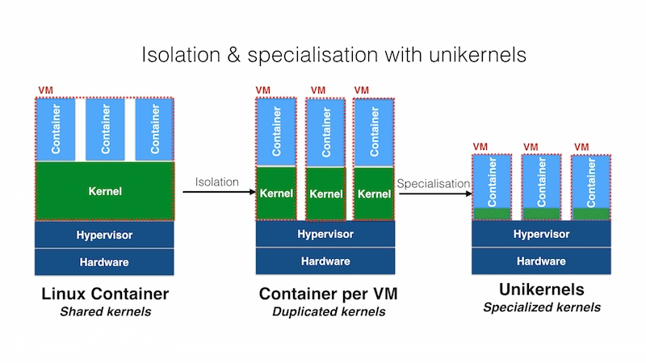

# IncludeOS on ARM 调研报告
- [IncludeOS on ARM 调研报告](#includeos-on-arm-%E8%B0%83%E7%A0%94%E6%8A%A5%E5%91%8A)
  - [项目简介](#%E9%A1%B9%E7%9B%AE%E7%AE%80%E4%BB%8B)
  - [项目背景](#%E9%A1%B9%E7%9B%AE%E8%83%8C%E6%99%AF)
    - [IoT](#iot)
    - [什么是Unikernel](#%E4%BB%80%E4%B9%88%E6%98%AFunikernel)
  - [立项依据](#%E7%AB%8B%E9%A1%B9%E4%BE%9D%E6%8D%AE)
    - [现有的 Unikernel 实现](#%E7%8E%B0%E6%9C%89%E7%9A%84-unikernel-%E5%AE%9E%E7%8E%B0)
      - [ClickOS](#clickos)
      - [Clive](#clive)
      - [DrawBridge](#drawbridge)
      - [HALVM](#halvm)
      - [includeOS](#includeos)
      - [LING](#ling)
      - [MigrageOS](#migrageos)
      - [OSv](#osv)
      - [Pumprun](#pumprun)
      - [runtime-js](#runtime-js)
      - [UniK](#unik)
    - [为什么选择 IncludeOS](#%E4%B8%BA%E4%BB%80%E4%B9%88%E9%80%89%E6%8B%A9-includeos)
  - [前瞻性分析](#%E5%89%8D%E7%9E%BB%E6%80%A7%E5%88%86%E6%9E%90)
  - [相关工作](#%E7%9B%B8%E5%85%B3%E5%B7%A5%E4%BD%9C)

## 项目简介

Includeos是一个 unikernel 的 C++ 实现，并可以在 bare-metal 上运行， IncludeOS 提供了丰富的用于网络编程的库，但是目前还不支持在 ARM 上运行。 IncludeOS 可以显著加快启动速度，并且减少进程切换等的无谓开销。现有的树莓派的 Unikernel 主要是对一些开关 GPIO 等相关的实现，但是对网络的支持很弱。在 IoT 领域中，有许多应用场景对延迟的要求十分苛刻，而本项目意在将 IncludeOS 移植到ARM上，这样对延迟敏感的 IoT 应用场景会有很大帮助。

## 项目背景

### IoT

IoT概念的提出，物联网的发展需要更强的及时性，降低延迟是工程师们一直在研究的重要课题。

### 什么是Unikernel

根据 kernel 的设计风格不同，操作系统可以被分成很多种类，比如 Linux 使用的是宏内核， Windows 使用的是混合内核。还有一种比较特别的内核类型叫做**外内核**(Exokernel)。传统的内核对硬件都做了抽象，避免应用程序直接访问硬件资源，只提供抽象层提供的接口，而外内核的不同之处在于它减少层次抽象并允许应用程序直接访问硬件和系统资源。用了Exokernel难道还要自己写各种硬件驱动，自己实现网络协议栈吗？为了避免使用 Exokernel 的开发人员自己手写各种硬件驱动等问题解决方案就是使用 Library Operation System。首先对硬件设备的驱动进行抽象，也就是定义一组接口，再针对不同硬件设备提供实现 library，在编译的时候，根据硬件配置引入合适的 library，应用和 library 一起构成了整个系统。这样做的优点如下：

- 减少了抽象层，可以直接操作硬件资源，操作系统可以具有更好的性能。
- 只包含应用和必要的 library ，没用冗余，资源占用更少。

Unikernel 也就由此而来。
Unikernel 的官方解释是
> Unikernels are specialised, single-address-space machine images constructed by using library operating systems.
即它是专用的，单地址空间的，使用 library OS 构建出来的镜像。

Unikernel 不仅可以运行在 bare-metal 上，也可以运行在虚拟机上。
Unikernel 的优点在于：
- 性能更好。相比于Linux/Windows这种通用操作系统，Unikernel减少了复杂的软件抽象层。由于“内核”和应用程序没有隔离，运行在同一个地址空间中，消除了用户态和内核态转换以及数据复制的开销。最后，构建时可以采用全局优化技术，比如前面的MirageOS，可以进一步优化性能。
- 资源占用更少。Linux/Windows里通常包含了太多东西，不论你需不需要，都会包含在系统里，比如各种文件系统，实际上用到的也就一两种。Unikernel里只包含了程序真正依赖到的东西，无论镜像，还是启动后所占用的资源都非常小。
- 启动快，这个就很好理解了，因为包含的东西少，系统层初始化非常快，通常是几ms到十几ms，真正的时间会用在应用程序本身的启动上。
- 更安全，因为Unikernel里运行的内容少，减少了潜在漏洞数量，相对攻击面就很小。

但 Unikernel 也存在一些缺点，最大的缺点就是 Unikernel 是完全不可调试的，出现问题的解决方案只有重启或者重写。

## 立项依据

### 现有的 Unikernel 实现
http://unikernel.org/projects/

#### ClickOS

ClickOS 是基于开源虚拟化技术的高性能虚拟化软件平台。ClickOS 的虚拟机很小（5MB），可以快速启动（20ms），延迟很小（45us）。

（可以考虑，但是没有明确的 ARM Portibility，并且没有 Bare-metal）。

#### Clive 

用 Go 语言编写的在分布式和云计算环境中工作的操作系统；裸机支持还在进行，且开发不是非常活跃。

#### DrawBridge

于应用程序沙盒的新型虚拟化形式的研究原型，结合了两个核心技术：Picoprocess 和 Library OS。

主要用于 Windows 程序的 Unikernel 化；没有计划要加入裸机的支持。

https://www.microsoft.com/en-us/research/project/drawbridge/?from=http%3A%2F%2Fresearch.microsoft.com%2Fen-us%2Fprojects%2Fdrawbridge%2F

#### HALVM

全程是 The Haskell Lightweight Virtual Machine。

Glasgow Haskell 编译器工具套件的一个移植，使开发人员能够编写可直接在 Xen 虚拟机管理程序上运行的高级、轻量 VMs。

#### includeOS

> In the summer of 2018 Horizon 2020 awarded the IncludeOS project funds to port IncludeOS to the ARM architecture. During 2019 we expect IncludeOS to boot on the Raspberry Pi M3 B+. Our goal is to provide your IoT project with a secure and real-time capable operating system on CPU platforms.
> https://www.includeos.org/blog/2018/port-to-arm.html
> 待交付，应该可行。

#### LING

> https://github.com/cloudozer/ling/tree/raspberry-pi

#### MigrageOS

> https://mirage.io/wiki/arm64
> Thanks to Solo5 and hvt MirageOS can run on ARM CPUs which support the ARM virtualization extensions. As the layer for Mirage currently only supports the 64bit architecture a 64bit CPU is required.

> So far this has been tested on the following SOCs.

> Broadcom BCM2837 on Raspberry Pi 3/3+
> Allwinner A64 on A64-OLinuXino / Pine A64
> Amlogic S905 on Odroid-C2
> It should be possible on all A53 based SOCs as long as a recent Kernel is available.

> In the following the process to build yourself a debian based firmware image for the raspberry Pi 3/3+ is described. For other targets the process is very similar and usually only differs in the bootloader related part.

> If you are not into builing your own image, you can try to use Arch Linux as they seem to ship KVM enabled 64bit Kernel for the Raspberry Pi.

#### OSv

> https://github.com/cloudius-systems/osv/wiki/AArch64

- HermitCore only on x86

Together, I believe unikernels have the potential to change the cloud-computing ecosystem as well as to dominate the emerging IoT market.

#### Pumprun

#### runtime-js

#### UniK

### 为什么选择 IncludeOS

## 前瞻性分析

## 相关工作
